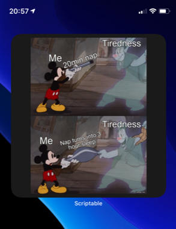

# random-meme.js
A Scriptable widget that shows random memes

 

  <a href="#setup">Setup</a> •
  <a href="#contribution">Contribution</a> •

## Setup

1. (if not done yet) Download the scriptable app form AppStore: https://apps.apple.com/de/app/scriptable/id1405459188
2. In Scriptable create a new script
3. Copy the code from file stock-random-meme.js: https://github.com/wickenico/random-meme.js/blob/main/random-meme.js
4. Create a new **large** widget on homescreen and select this script in scriptable

## Contribution

If you have any ideas for extensions or changes just let me know.
